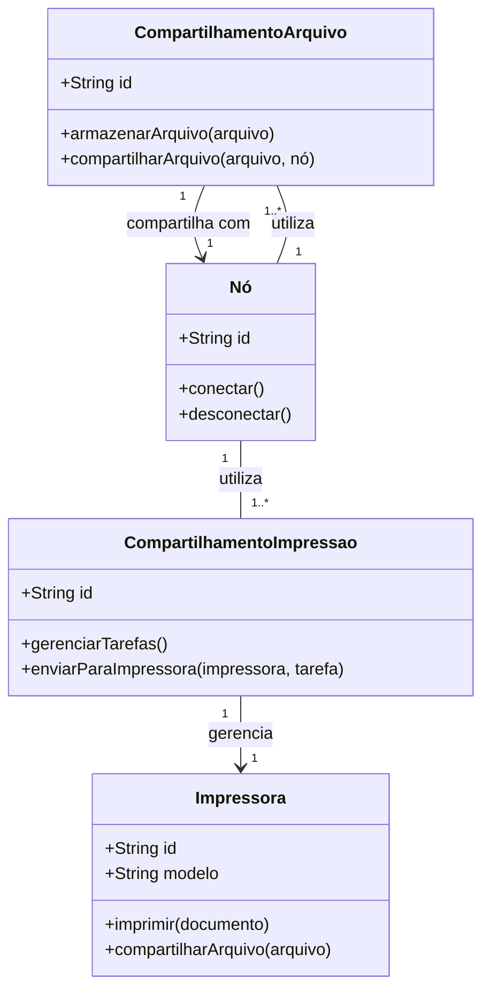
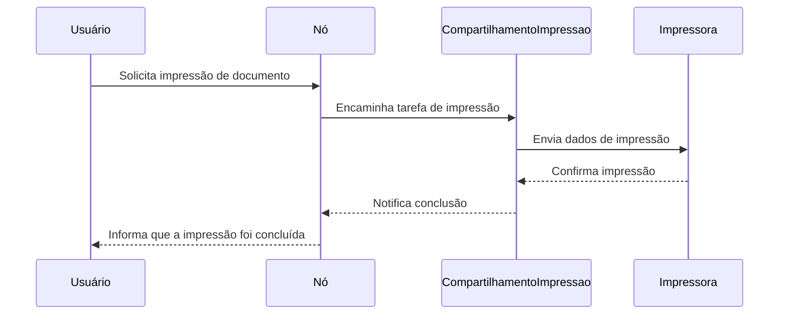
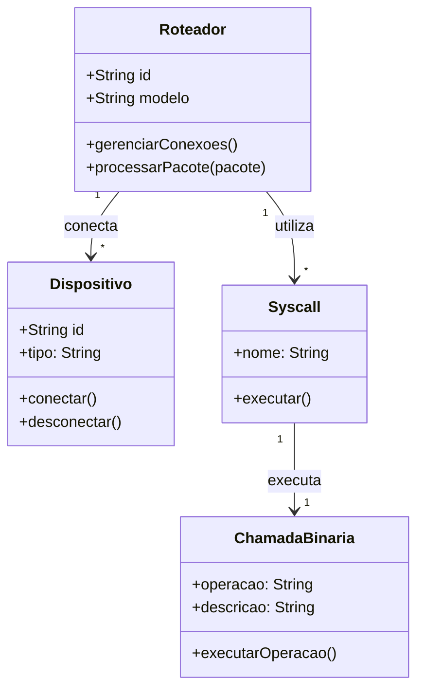
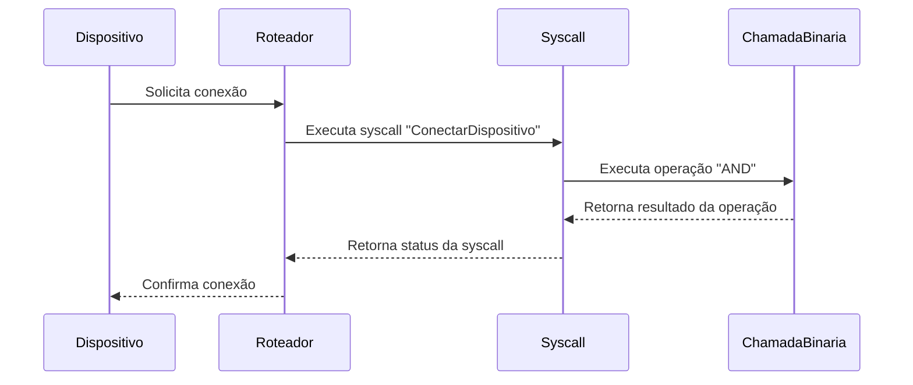
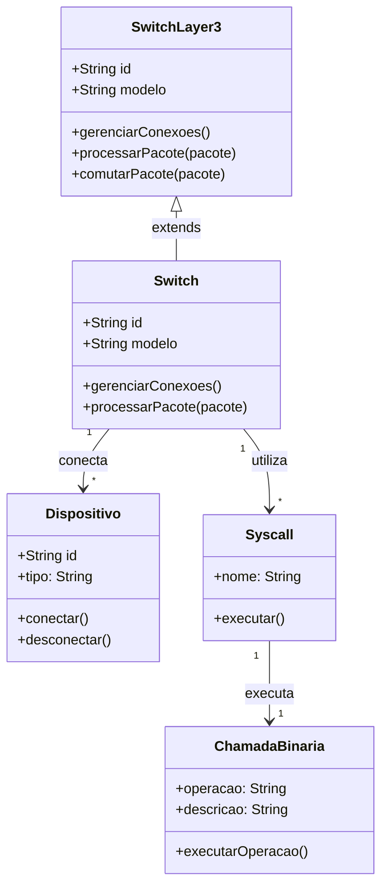
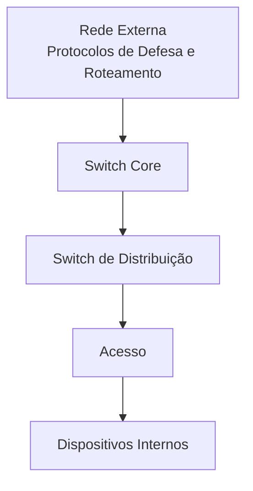
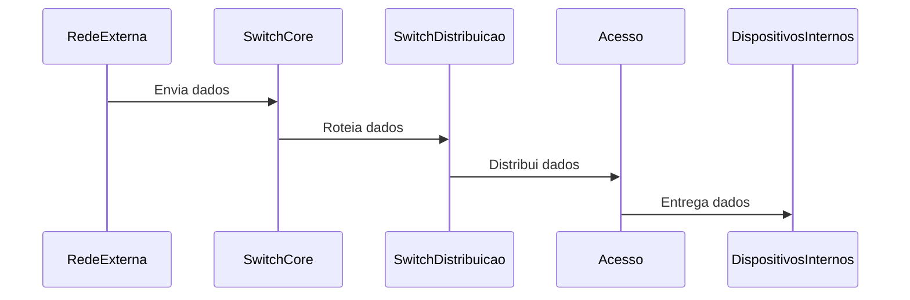

# Base

### 3. **Modelos de Rede: Ponto a Ponto e Cliente-Servidor em Profundidade**

#### **Modelo Ponto a Ponto: Escalabilidade e Limitações Intrínsecas**

No modelo ponto a ponto, o software cliente e servidor operam em máquinas distintas, proporcionando uma escalabilidade que, embora limitada pelo número de placas de rede disponíveis, oferece uma flexibilidade comparável à distribuição de cargas de trabalho entre neurônios em um sistema neural distribuído. Este modelo permite que cada nó na rede funcione de maneira autônoma, similar aos neurônios que operam de forma independente, mas em sincronia com outros para processar informações complexas.

A escalabilidade desse modelo é comparável à capacidade de crescimento de um sistema nervoso central, onde a adição de novos neurônios pode aumentar a capacidade de processamento, mas é limitada pela conectividade e pela eficiência das vias de comunicação. A utilização de uma única máquina para atuar como servidor e cliente simultaneamente espelha a capacidade dos neurônios de desempenharem múltiplas funções, dependendo das demandas do sistema.

**Vantagens Avançadas do Modelo Ponto a Ponto**

* **Facilidade de Configuração**: A simplicidade estrutural deste modelo reduz a complexidade operacional, permitindo uma implementação rápida e de baixo custo. Essa característica é semelhante à plasticidade sináptica, onde conexões simples podem ser estabelecidas rapidamente para facilitar a transmissão de sinais.
* **Aplicações Específicas**: Ideal para LANs e redes pessoais onde a colaboração entre um grupo restrito de dispositivos é necessária. Este modelo promove uma comunicação direta e eficiente, análoga à comunicação rápida entre neurônios em redes pequenas e altamente especializadas.

**Desvantagens Intrincadas do Modelo Ponto a Ponto**

* **Escalabilidade Limitada**: A capacidade de expansão é restringida pelo número de interfaces de rede disponíveis, refletindo a limitação da densidade sináptica em sistemas neurais altamente compactos.
* **Segurança Vulnerável**: A ausência de uma estrutura hierárquica centralizada aumenta os riscos de segurança, pois qualquer dispositivo na rede pode potencialmente comprometer a integridade de todo o sistema. Este cenário é comparável a um neurônio comprometido que pode propagar disfunções em uma rede neural.

#### **Modelo Cliente-Servidor: Centralização e Eficiência Estratégica**

O modelo cliente-servidor representa uma arquitetura onde servidores centralizados gerenciam recursos e atendem a múltiplos clientes de forma eficiente e segura. Este modelo pode ser entendido como o sistema nervoso central, onde o cérebro processa informações e coordena respostas para diversos estímulos provenientes dos neurônios periféricos.

**Funcionamento Avançado do Modelo Cliente-Servidor**

No contexto de redes locais, servidores atuam como repositórios de dados e gerenciadores de serviços, processando solicitações de clientes de maneira ordenada e eficiente. Por exemplo, um roteador pode servir como um servidor que direciona tráfego para serviços web específicos, utilizando algoritmos de roteamento baseados em teoria de jogos para otimizar a distribuição de pacotes de dados.

A utilização de modelos matemáticos avançados, como grafos direcionados e fluxos de rede, permite que os servidores gerenciem o fluxo de dados de maneira eficiente, evitando congestionamentos e assegurando a entrega rápida e segura das informações. A interação entre servidores e clientes pode ser modelada utilizando sistemas de equações diferenciais que descrevem a dinâmica do tráfego de dados e a resposta a diferentes cargas de trabalho.

**Vantagens Estratégicas do Modelo Cliente-Servidor**

* **Gerenciamento Centralizado**: Facilita a implementação de políticas de segurança robustas e a administração eficiente dos recursos de rede, similar à função reguladora do hipotálamo no corpo humano.
* **Escalabilidade e Flexibilidade**: Permite a adição de mais servidores para atender ao aumento da demanda sem comprometer a performance, refletindo a capacidade adaptativa dos sistemas biológicos a diferentes níveis de estímulo.

**Desafios Complexos do Modelo Cliente-Servidor**

* **Ponto Único de Falha**: A centralização pode criar vulnerabilidades críticas, onde a falha de um servidor pode impactar toda a rede, análogo a uma lesão cerebral que afeta múltiplas funções corporais.
* **Sobrecarga de Recursos**: Servidores podem ser sobrecarregados com múltiplas solicitações simultâneas, exigindo a implementação de balanceamento de carga e algoritmos de priorização para manter a eficiência, similar à regulação homeostática do corpo humano para evitar o colapso sob estresse.

***

### 4. **Componentes Essenciais para o Funcionamento da Rede: A Sinfonia dos Elementos Tecnológicos**

#### **Placa Adaptadora de Rede e Drivers: Os Sentidos e Reflexos da Rede**

A placa adaptadora de rede (NIC) atua como o sistema sensorial de um computador, capturando e transmitindo sinais digitais através da rede. Similar aos receptores sensoriais nos organismos biológicos, as NICs convertem sinais elétricos em dados digitais que podem ser processados pelo sistema operacional. A eficiência dessa conversão é crucial para a performance geral da rede, influenciando diretamente a latência e a largura de banda disponíveis.

Os drivers de placa de rede funcionam como os neurônios espelho, facilitando a comunicação entre o hardware físico da NIC e o sistema operacional. Esses drivers traduzem as instruções de alto nível em comandos de baixo nível que a placa pode entender e executar, garantindo uma transmissão de dados fluida e eficiente. A otimização dos drivers é fundamental para minimizar a sobrecarga do sistema e maximizar a performance da rede, semelhante à forma como os neurônios espelho aprimoram a eficiência das respostas motoras.

#### **Sistema Operacional de Rede: A Lógica Central e a Coordenação**

O sistema operacional de rede (NOS) é a lógica central que gerencia os recursos da rede, coordenando a comunicação entre dispositivos e garantindo a integridade dos dados. Este componente é análogo ao córtex cerebral, responsável pela coordenação de funções cognitivas e motoras complexas. O NOS implementa protocolos de comunicação, gerencia tabelas de roteamento e supervisiona a segurança da rede, utilizando algoritmos avançados para otimizar a eficiência e a resiliência da infraestrutura de rede.

Além disso, o NOS integra técnicas de programação de baixo nível para interagir diretamente com o hardware da rede, permitindo a execução de operações de alto desempenho e a implementação de mecanismos de segurança robustos. A capacidade de adaptação e auto-regulação do NOS é comparável à plasticidade neural, onde o sistema operacional ajusta dinamicamente suas estratégias de gerenciamento para responder a mudanças nas condições da rede e nas ameaças de segurança.

#### **Meios de Transmissão e Equipamentos de Concentração: A Linguagem e a Estrutura Física da Rede**

Os meios de transmissão, sejam cabeados ou sem fio, são a linguagem e os padrões através dos quais os dados são transmitidos na rede. Cabos de alta qualidade e tecnologias sem fio avançadas garantem uma comunicação rápida e confiável, similar à eficiência das vias nervosas na transmissão de sinais no corpo humano. A escolha do meio de transmissão afeta diretamente a velocidade, a distância e a confiabilidade da comunicação de dados, influenciando a arquitetura geral da rede.

Os equipamentos de concentração, como switches e roteadores, formam a estrutura lógica e física da rede, direcionando o tráfego de dados de maneira eficiente e segura. Esses dispositivos são essenciais para a segmentação da rede, evitando congestionamentos e garantindo que os dados cheguem ao destino correto sem interferências. A implementação de switches CORE em redes de alta densidade permite uma comutação rápida e eficiente de pacotes IP, suportando a crescente demanda por largura de banda e conectividade em ambientes corporativos e institucionais.

#### **Servidores: A Funcionalidade e o Fluxo Cognitivo da Rede**

Os servidores são as máquinas que fornecem serviços e recursos para os clientes na rede, atuando como repositórios de dados e pontos de processamento centralizados. Cada servidor pode executar múltiplos softwares especializados, como firewalls, servidores de arquivos e serviços de versionamento, garantindo que a rede atenda às necessidades específicas dos usuários de maneira eficiente e segura. A capacidade dos servidores de gerenciar múltiplas conexões simultâneas e distribuir recursos de maneira equilibrada é comparável à função executiva do córtex pré-frontal, coordenando as atividades cognitivas e comportamentais para atingir objetivos complexos.

Além disso, os servidores podem implementar técnicas de programação de baixo nível para otimizar o desempenho e a segurança da rede, utilizando linguagens como C e Assembly para maximizar a eficiência e reduzir a latência. A integração de algoritmos de aprendizado de máquina permite que os servidores adaptem suas operações em tempo real, melhorando a resposta a ameaças de segurança e otimizando o fluxo de dados com base nas necessidades dinâmicas dos usuários.

***

### 5. **Switches: O Coração Tecnológico da Rede Local**

#### **Switches de Camada 2 e Camada 3: Arquiteturas Cognitivas Avançadas**

Os switches são dispositivos cruciais que operam na camada 2 (enlace) do modelo OSI, realizando a comutação de frames Ethernet com base em endereços MAC. Funcionando como estruturas cognitivas análogas aos circuitos neurais, os switches direcionam os dados de forma eficiente através da rede, evitando colisões e congestionamentos. Eles mantêm tabelas MAC que armazenam endereços físicos e as portas correspondentes, permitindo uma comutação rápida e precisa dos frames.

Existem também switches Layer 3, conhecidos como switches CORE, que além da comutação de frames, também gerenciam pacotes IP, atuando como roteadores dentro da rede local. Esses switches são essenciais para redes de alta densidade, onde a comutação rápida de pacotes IP é necessária para manter a fluidez e a eficiência do tráfego de dados. A capacidade dos switches Layer 3 de realizar roteamento interno permite uma segmentação mais granular e uma distribuição de carga mais eficiente, semelhante à maneira como diferentes regiões do cérebro processam informações de maneira especializada e coordenada.

#### **Funções Avançadas dos Switches**

* **Segmentação de Rede e Isolamento Dinâmico**: Os switches segmentam a rede em sub-redes menores, direcionando dados apenas para os segmentos necessários com base nos endereços MAC. Este isolamento dinâmico evita congestionamentos e colisões, similar à segregação funcional de diferentes áreas cerebrais que processam informações específicas sem interferência mútua.
* **Evitar Congestionamentos e Colisões**: Implementando técnicas de gerenciamento de fluxo e priorização de pacotes, os switches mantêm a integridade e a eficiência da rede, evitando sobrecargas e perdas de dados. Estes mecanismos são comparáveis aos sistemas de regulação homeostática do corpo humano, que mantêm o equilíbrio interno diante de variações externas.
* **Comunicações Simultâneas e Paralelismo**: Capazes de suportar múltiplas comunicações simultâneas, os switches garantem que diferentes fluxos de dados possam ocorrer de forma paralela sem interferir uns com os outros. Este paralelismo é semelhante à capacidade do cérebro humano de processar várias tarefas simultaneamente, mantendo a coesão e a eficiência.
* **Tabelas MAC e Estruturas de Dados Complexas**: As tabelas MAC são estruturas de dados multidimensionais onde cada entrada corresponde a um endereço MAC associado a uma porta específica. Estas tabelas funcionam como mapas de conectividade neural, onde cada conexão é armazenada e gerenciada de maneira eficiente para otimizar a transmissão de dados.

#### **Propagação de Broadcast e Atualização de Tabelas MAC**

Embora switches geralmente não propagam broadcasts de maneira indiscriminada, existem situações específicas onde isso é necessário, como na atualização das tabelas MAC e na interação com servidores DHCP. Nestes casos, os switches utilizam algoritmos avançados de detecção e resposta para garantir que os broadcasts sejam gerenciados de maneira eficiente, minimizando o impacto no desempenho geral da rede.

#### **Ethernet e Segurança dos Switches**

Os switches Ethernet direcionam frames com base nas tabelas MAC e são projetados para serem plug and play, facilitando a configuração e a manutenção da rede. A segurança dos switches é reforçada por mecanismos que bloqueiam portas automaticamente em situações suspeitas, prevenindo acessos não autorizados e ataques de invasão.

**Comandos Avançados para Gerenciamento de Switches**

* `show mac-address-table`: Exibe o conteúdo atual da tabela MAC, permitindo a análise e o monitoramento das conexões da rede.
* `clear mac-address-table`: Limpa a tabela MAC, forçando os switches a reconstruí-la a partir de novos pacotes de dados, útil para resolver conflitos ou atualizar configurações de rede.

#### **Segurança Avançada e Detecção de Anomalias**

Switches modernos podem carregar arquivos binários que implementam funções avançadas de segurança. Embora isso introduza riscos potenciais, como a injeção de binários maliciosos na rede, a utilização de algoritmos de Machine Learning permite a detecção e a resposta a anomalias de maneira proativa. Esses algoritmos monitoram continuamente o tráfego de dados e as atividades da rede, identificando padrões suspeitos e respondendo a ameaças em tempo real, similar aos mecanismos de resposta imunológica do corpo humano.

**Modelo de Rede com Switches CORE**

A arquitetura de rede com switches CORE, distribuição e acesso é essencial para a criação de uma infraestrutura robusta e escalável. A VPN (Virtual Private Network) é implementada como um algoritmo de criptografia que protege os pacotes de dados, atuando como uma camada adicional de segurança, mas não substituindo a infraestrutura física da rede.

#### **Camada de Redes: Arquitetura em Profundidade**

A arquitetura em camadas organiza a rede de maneira eficiente, distribuindo funções e responsabilidades entre diferentes níveis. Este modelo hierárquico facilita a escalabilidade, a manutenção e a segurança da rede, assegurando que cada camada execute suas funções específicas de maneira otimizada.

#### **Segurança Adicional: VPN e Criptografia Avançada**

A implementação de VPNs em redes locais utiliza algoritmos de criptografia avançados para proteger os pacotes de dados contra interceptações e ataques de invasão. A VPN atua como uma camada de segurança adicional, encapsulando os dados e garantindo que apenas dispositivos autorizados possam decifrar e acessar as informações transmitidas. Este mecanismo é fundamental para proteger a integridade e a confidencialidade dos dados em ambientes corporativos e sensíveis, complementando as medidas de segurança implementadas nos switches e outros dispositivos de rede.

***

### Conclusão: A Sinergia entre Tecnologia e Ciência Biológica nas Redes Locais

Compreender a estrutura e os componentes de uma rede local vai além da simples configuração de dispositivos e protocolos. Este guia oferece uma visão abrangente e interdisciplinar, conectando conceitos de matemática, neuroanatomia, neurofisiologia, biologia, fisiologia, teoria de jogos, técnicas de invasão e programação de baixo nível para revelar a complexidade e a sofisticação das redes locais modernas. Assim como o cérebro humano, uma rede local eficiente e segura é resultado da interação harmoniosa entre diversos componentes e processos, cada um desempenhando um papel crucial na manutenção da integridade e da funcionalidade do sistema como um todo.

Se você é um entusiasta ou um profissional de redes em busca de uma compreensão profunda e técnica sobre o funcionamento das redes locais, este guia oferece as ferramentas e o conhecimento necessários para projetar, implementar e gerenciar redes que são tão resilientes e adaptáveis quanto os sistemas biológicos mais complexos.

***

### Índice

1. [Origem e Evolução das Redes Locais: Da Simplicidade ao Complexo](./#1-origem-evolução-das-redes-locais-da-simplicidade-ao-complexo)
2. [Arquitetura de Redes: Estruturas Complexas Inspiradas na Biologia](./#2-arquitetura-de-redes-estruturas-complexas-inspiradas-na-biologia)
3. [Modelos de Rede: Ponto a Ponto e Cliente-Servidor em Profundidade](./#3-modelos-de-rede-ponto-a-ponto-e-cliente-servidor-em-profundidade)
4. [Componentes Essenciais para o Funcionamento da Rede: A Sinfonia dos Elementos Tecnológicos](./#4-componentes-essenciais-para-o-funcionamento-da-rede-a-sinfonia-dos-elementos-tecnológicos)
5. [Switches: O Coração Tecnológico da Rede Local](./#5-switches-o-coração-tecnológico-da-rede-local)
6. [Conclusão: A Sinergia entre Tecnologia e Ciência Biológica nas Redes Locais](./#conclusão-a-sinergia-entre-tecnologia-e-ciência-biológica-nas-redes-locais)
7. [Índice](./#índice)

***

### License

Este projeto está licenciado sob a licença MIT. Veja o arquivo [LICENSE](LICENSE/) para mais detalhes.

### Contato

Para mais informações, visite [nosso site](https://www.seusite.com) ou entre em contato através do email contato@seusite.com.

### Agradecimentos

Agradecemos a todos que contribuíram para a criação e aprimoramento deste guia sobre redes locais, especialmente aos profissionais e pesquisadores que compartilharam seus conhecimentos e experiências para enriquecer este conteúdo técnico avançado.

***

Esperamos que este guia tenha proporcionado uma compreensão profunda e técnica sobre o funcionamento e a estrutura das redes locais. Continue explorando, aprendendo e contribuindo para o avanço das tecnologias de rede que moldam o nosso mundo digital!
