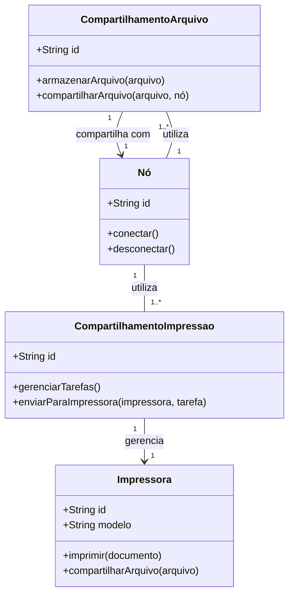
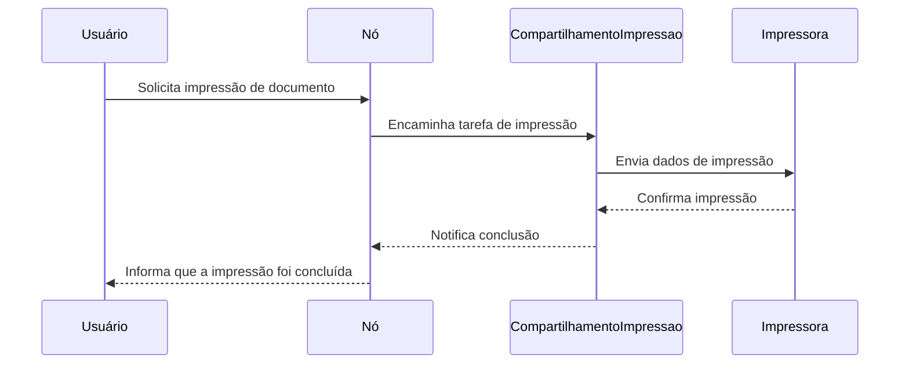
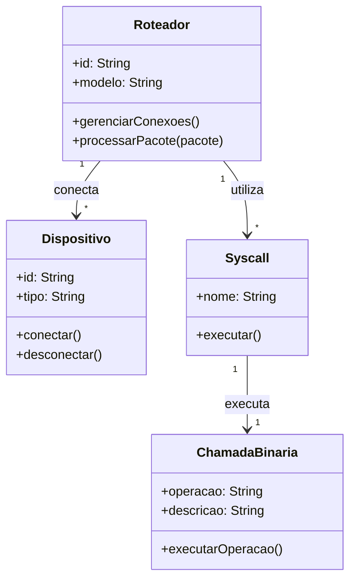
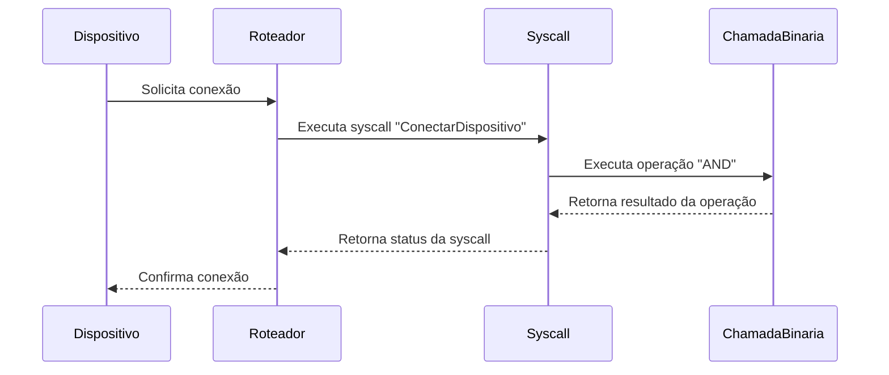
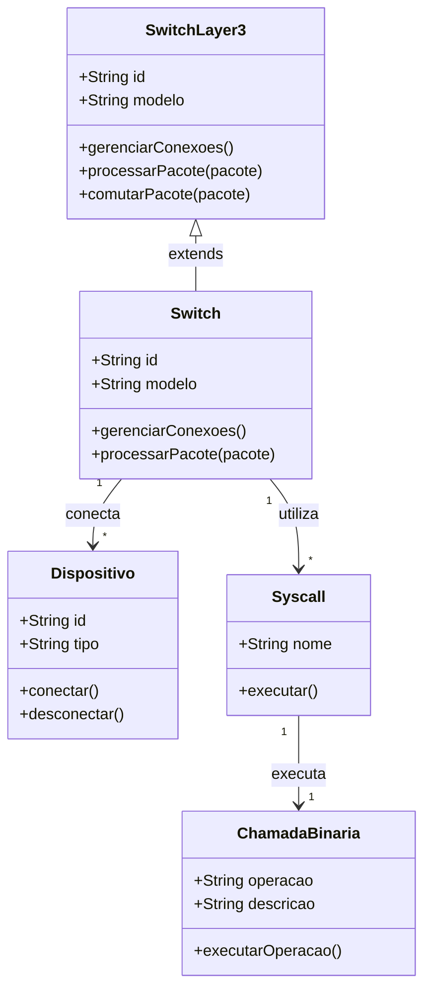
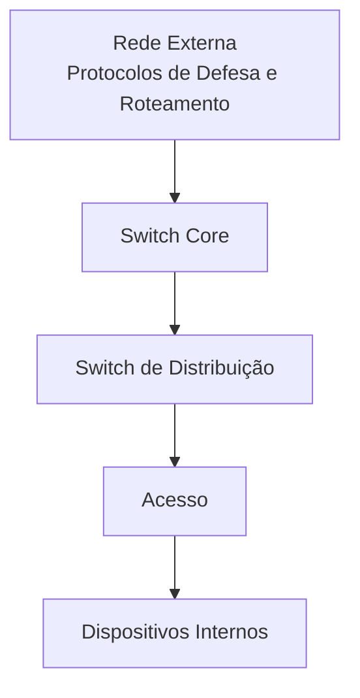
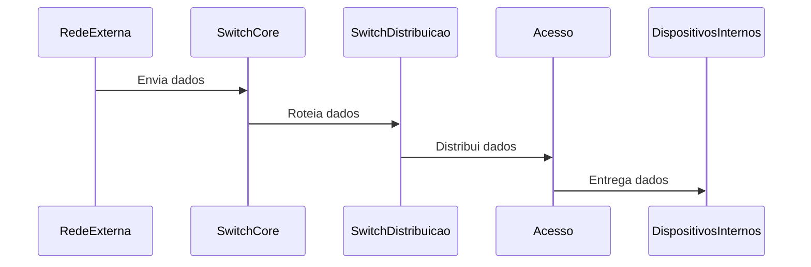

Rede Local - Como surgiu?

A popularização dos computadores pessoais (PCs) exigiu a troca constante de informações, evoluindo da troca física de disquetes para a troca lógica, realizada através de pontos, onde cada dispositivo é um nó no grafo e as arestas são as conexões lógicas por onde os estados binários atravessam. Esse processo segue modelos matemáticos através de listas que transformam tensores em representações binárias e instruções.

## Arquitetura de Redes

Cada tipo de rede pode ser representado por um modelo matemático, incluindo:

- **Rede Cliente-Servidor**
- **Peer-to-Peer**
- **Camadas**
- **Árvore**
- **Anel**
- **Malha**

Cada tipo de rede funciona como uma aresta que gera um grafo lógico com base no contexto de como os dados atravessam e seus "estados" mentais. Cada modelo é adaptável à situação em função do uso e da segurança.

Os meios de transmissão podem ser tanto cabeados quanto sem fio.

---

## Modelo Ponto a Ponto

O software cliente e servidor são executados em computadores separados. Embora seja escalável, essa escalabilidade é limitada pelo número de placas de rede disponíveis. Em alguns casos, o mesmo computador pode executar tanto o servidor quanto o cliente.

### Vantagens

- **Facilidade de Configuração**: Menos complexo e de menor custo.
- **Aplicações**: Usado em LANs e redes pessoais, onde não é necessário um gerenciador lógico. Apenas um pequeno grupo de pessoas pode chegar a um consenso.

### Desvantagens

- **Escalabilidade Limitada**: A escalabilidade é restrita.
- **Segurança**: Falta de segurança, pois qualquer usuário tem poder sobre a rede.

---

## Múltiplas Funções na Rede

Um computador com software de servidor pode fornecer serviços simultaneamente a um ou vários clientes.

Além disso, um único computador pode executar vários softwares do tipo servidor, como firewalls especializados, que funcionam como uma representação do pré-frontal e neurotransmissores inibitórios. Há várias funções, como versionamento ou compartilhamento de arquivos, mas a rede é tão inteligente quanto os usuários e suas necessidades. Como eu disse, o computador é uma extensão cognitiva do cérebro.

Um único computador pode executar vários tipos de software cliente. Deve haver um software para cada arquivo.

Para mim, cada servidor é um arquivo binário sendo executado em uma máquina que direciona arestas lógicas para permitir o fluxo ordenado de informações e representações binárias.

---

## Modelo Cliente-Servidor

Carrega as instruções que mapeiam o fluxo de dados. Por exemplo, o roteador serve serviços e mapeia direcionamentos para o serviço web, carregando um binário interno.

No caso, o servidor representa vários arquivos.

---

## Necessidades para a Rede Funcionar

- **Placa Adaptadora de Rede** (Sistema Sensorial)
- **Driver de Placa de Rede** (Neurônios Espelhos)
- **Sistema Operacional de Rede** (Lógica por Trás)
- **Cabo e Meio de Transmissão** (A Linguagem e Padrões de Significados)
- **Equipamento de Concentração** (A Estrutura Lógica Física, como Cultura)
- **Servidor** (Serve Funcionalidade)

---

## Switch

O switch é um equipamento que opera na camada 2 (enlace) do modelo OSI, atuando como uma estrutura cognitiva de forma análoga. Ele realiza a comutação de frames Ethernet via hardware, utilizando endereços MAC. Não trabalha com IP, roteamento de IP, tabelas de IPs, etc.

Existem switches Layer 3 que, além da comutação de frames, também comutam pacotes. São conhecidos como switches CORE nas redes locais, devido à comutação de pacotes IP distintos e à alta densidade de portas.

Lembre-se de que o IP configurado no switch serve apenas para gerenciamento remoto.

### Funções do Switch

- **Segmentação de Rede**: Permite passar para outro segmento de rede somente os dados destinados a esse segmento, utilizando o endereço MAC presente nos quadros Ethernet.
- **Evitar Congestionamentos e Colisões**: Faz a segmentação da rede para evitar congestionamentos e colisões em uma rede local que possam interferir em outra.
- **Comunicações Simultâneas**: Mais de uma comunicação pode ser realizada simultaneamente, desde que as comunicações não envolvam as portas de origem e destino que já estão em uso.
- **Tabelas MAC**: Trabalha com tabelas contendo endereços MAC que são consultadas quando chega um novo quadro Ethernet com endereços físicos de origem e destino.

### Propagação de Broadcast

Embora o switch não propague broadcast na prática, existem algumas situações específicas onde isso acontece:
- Quando precisa atualizar a tabela MAC.
- Quando trabalha em conjunto com um servidor DHCP.

### Ethernet

O switch direciona frames com base em tabelas MAC. Ele é plug and play e possui uma configuração que bloqueia a porta automaticamente quando necessário.

As tabelas MAC são tensores multidimensionais, onde cada coluna é um vetor e as linhas representam interseções entre potencialidades semânticas (IP, nome, MAC).

Para que a tabela MAC seja criada, é necessário haver um impulso entre uma máquina e outra, e o switch precisa de no mínimo um pulso para atualizar. Ele pode atualizar a cada pulso, adicionando o MAC e o IP à lista, ou salvar um estado e atualizar apenas quando um pulso anômalo é detectado.

### Comandos Úteis

- `show mac-address-table`: Verifica o conteúdo da tabela MAC.
- `clear mac-address-table`: Deleta o conteúdo da tabela MAC.

### Segurança e Anomalias

O switch carrega arquivos binários. Em teoria, seria possível carregar um binário na rede e mapear diretamente para o switch, disfarçando o MAC em caso de testes de penetração. No entanto, isso envolve riscos de segurança.

Às vezes, é necessário deletar endereços obsoletos, mas o próprio switch pode apagar o que não é mais utilizado. Um algoritmo de ML poderia registrar anomalias e substituir por camadas o que é padrão e esperado, onde um pulso tensorial define o peso da memorização e anomalia.

### Modelo de Rede

1. **Switch Core**
2. **Distribuição**: Roteamento entre VLANs.
3. **Acesso**

A VPN é um algoritmo de criptografia dos pacotes, não um cabo entre unidades.

---

## Diagrama de Classe do Switch

---

## Camada de Redes

