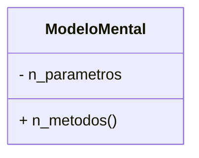
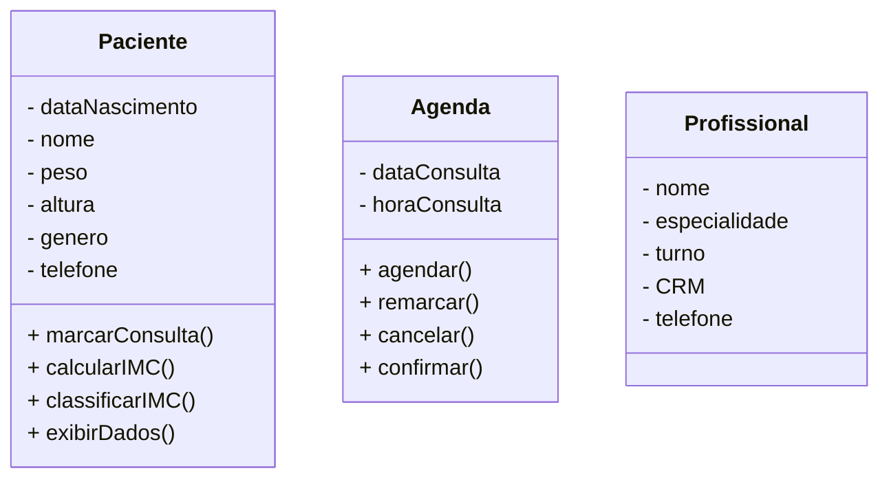

# Lógica de Programação – Primeiro uso de uma IDE

## 1. A Manifestação do Código: **Caminho do Hardware à Consciência**

Bom, essa é a compilação do que aprendi com o professor Celso em lógica de programação. Planejo usar esse espaço como um dump mental para compilar cada matéria, e aprender no processo, fazendo uma "escovagem" de bits neural.

### 1.1 Representação do código

Um código nada mais é do que a tentativa de mapear uma intenção em um conjunto de regras formais que um processador entende. Quando um ser humano escreve um programa, ele está manipulando camadas interligadas que vão desde a **abstração semântica** (o conceito mental de “loop”, “decisão”, “repetição”) até a execução de elétrons atravessando os transistores.

Cada instrução que se escreve é um **evento neurocognitivo** traduzido em **tokens semânticos**, que depois são compilados, traduzidos para instruções de máquina, e finalmente processados na forma de pulsos elétricos. ~~um código nada mais é do que uma alucinação bem-organizada.~~

Na prática, qualquer linha de código é **uma jogada em um jogo computacional**. Quando se escreve uma função, está-se definindo um **espaço de decisão**, onde o sistema operacional, o compilador e até a CPU têm opções estratégicas de execução.

### 1.2 Como é Feito a Nível Binário e Estruturação de Uma Linguagem Forte

O kernel do sistema operacional age como um **agente que controla os recursos computacionais**. Ele decide:

* **Alocar ou não memória** (controle do heap e da stack).
* **Permitir ou bloquear processos** (gerenciamento de threads).
* **Atribuir prioridade a operações** (escalonamento de CPU).

A previsibilidade da computação pode ser explorada por vulnerabilidades. **Tudo que segue uma regra pode ser quebrado por uma heurística superior**. Exemplos:

* **Buffer Overflow:** Explorando falhas na alocação de memória.
* **Race Conditions:** Manipulação de processos concorrentes.
* **Ataques de Escalonamento de Prioridade:** Sequestro de processamento para vantagem estratégica.

Por isso o uso de uma linguagem antiga, robusta e utilizada é a melhor forma de se estruturar e programar. Embora abordagens contemporâneas permitam o uso de recursos específicos, uma linguagem como o Java garante segurança e integridade no projeto. A estrutura da computação deve ser eficiente, mas também resiliente contra exploração maliciosa.

### **1.3 Escolha de Linguagens para Diferentes Aplicações**

* **Python** pode ser visto como um "Lego de linguagens", permitindo a montagem de soluções com alto nível de abstração e simplicidade sintática.
* Para desenvolvimento **mobile**, ele recomenda **Kotlin** para Android e **React Native (com Switch)** para multiplataforma.
* O **COBOL** ainda é amplamente utilizado no setor bancário, e sua manutenção se torna mais crítica com o tempo devido à necessidade constante de correção de bugs e modernização.

### 1.4 Paralelos com neuroanatomia:

O kernel do sistema operacional recebe os comandos e decide como lidar com essa demanda. Em última instância, a lógica da computação imita a lógica do cérebro humano, onde:

* Um neurônio individual é como um transistor: ele dispara ou não dispara.
* Uma sinapse é como uma chamada de função: ela passa um valor adiante, dependendo do estado anterior, onde usando grafos de ramificação, as arestas podem ser representados por '.'.
* A memória RAM funciona como o hipocampo: acessa e organiza dados temporários.
* A CPU é o córtex pré-frontal: processa decisões lógicas e cálculos complexos.

Toda vez que um código é compilado, ele passa por uma série de etapas que transformam ideias em números, números em bits ~~e bits em porra nenhuma~~. A abstração máxima disso se manifesta em máquinas de Turing, onde cada passo é uma instrução lógica irrefutável. A partir desse ponto, um programa deixa de ser apenas uma construção mental e se torna uma extensão funcional do universo computacional.

### **1.5 Exemplo mental de OOP aplicada à percepção humana:**

Enfatizando paradigmas estruturados e **Orientação a Objetos (OOP), o** professor destacou a importância da **OOP**, que pode ser aplicada em qualquer linguagem e até mesmo na abstração de **diagramas de classe**. A modelagem baseada em objetos facilita a representação de conceitos complexos, o que permite usar OOP como uma forma de **mapear o universo**, funcionando como um análogo computacional da forma como a consciência processa eventos.

Modelos mentais podem ser vistos como **classes**, por exemplo, características como **distância entre queixo e nariz** formam um parâmetro com uma margem de erro que define o intervalo entre o previsível e o anormal. Esse processamento segue uma lógica **Bayesiana**, onde eventos são constantemente atualizados e reprocessados para determinar se requerem atenção consciente(metodos e parâmetros). Se um evento ultrapassa um limiar probabilístico, a consciência entra em ação, modificando os métodos e parâmetros da classe correspondente.&#x20;

Por exemplo:



As classes podem ser separadas entre atributos (-) ou métodos (+), que definem o que é parametrizado e o que é feito com essas informações. Elas determinam o que será retornado (caso haja necessidade de manipulação do valor) ou null, caso seja para alterar os próprios parâmetros.

Uma boa prática é modular o máximo possível de cenários, abstraindo ao máximo a realidade. O peso só existe quando o objeto é criado da classe na memória RAM, então posso abstrair quantas classes forem necessárias, limitando-se à capacidade humana de gerenciar tudo sem se perder no processo.


## 2. Exemplo Prático

### 2.1 IDE

O **JetBrains IntelliJ** é um editor robusto e amplamente utilizado para desenvolvimento Java e Kotlin, mas requer uma licença. O **Eclipse**, por outro lado, é gratuito e, segundo o professor, a melhor opção para o curso. Antes de instalar o IntelliJ, é necessário ter o **JDK** (Java Development Kit) instalado. Durante a instalação, é recomendável marcar a opção para adicionar os **binários do PATH do Windows**, garantindo acesso a comandos específicos no terminal.

No processo de licenciamento do IntelliJ pelo **SENAI**, há um mecanismo de empacotamento de variáveis de ambiente que vincula a ferramenta ao meu e-mail institucional. Se o login for feito diretamente pelo navegador, o sistema carrega apenas um script, mas ao fazer a solicitação via IDE, a autenticação ocorre corretamente. Estou utilizando meu **GitHub**, que já está vinculado ao meu e-mail principal.

### **2.2 Estrutura de Grafos e Organização de Projetos na IDE**

As **IDEs modernas** criam uma **estrutura de grafos de ramificação**, onde cada diretório e arquivo funciona como um **nó** e as relações entre eles são representadas por **arestas**.

#### **Pastas Especiais e Configurações**

* Qualquer pasta que começa com `.` (ponto) é de **configuração do sistema**. Essas pastas podem ser **críticas e perigosas**, pois armazenam arquivos essenciais para a IDE e o ambiente de desenvolvimento. Alterações indevidas podem corromper configurações ou afetar a execução do projeto.

#### **Estrutura do Código-Fonte (src) e Organização do Grafo**

* O diretório **`src`** (source) é o **nó raiz** do grafo do código-fonte, de onde todas as ramificações se originam.
* Ao invés de usar pastas, utilizamos **pacotes**, que funcionam como **módulos encapsulados**, organizando o código de maneira hierárquica e evitando conflitos.
* O nome do pacote deve ser o mesmo nome da função, pois o uso de arestas aponta onde está, e chama o binário de instruções;
* No caso, é necessário sempre definir um dominio indo de trás pra frente;
* O nome do dominio é necessário para garantir unicidade, pois quanto mais palavras interseccionadas, menos a potencialidades semantica;
* A classe deve sempre ficar hierarquicamente dentro da pasta raiz;

#### **Pacotes e Arestas do Grafo com `.` (ponto)**

* O **nome de um arquivo não é apenas um nome isolado**, mas parte de um **caminho estruturado**. O uso do `.` como separador representa **as arestas do grafo**, conectando pacotes e arquivos sem risco de conflito por repetição de nomes.
* Esse mesmo conceito se estende para outras áreas da computação, como:
  * **Sistemas de arquivos UNIX** (`.config`, `.git`, etc.)
  * **Redes e DNS** (`br.com.sp` sendo lido da esquerda para a direita)

#### **External Libraries e Dependências**

* A estrutura **`External Libraries`** contém bibliotecas externas essenciais para a execução da aplicação. Essas bibliotecas são referenciadas no projeto, mas não estão diretamente dentro do código-fonte principal.

#### **Latência, Eficiência e Precisão Numérica**

* Em sistemas de larga escala, a **latência** das chamadas externas deve ser considerada, pois **cada bit transmitido impacta o desempenho**.
* No contexto de cálculos matemáticos, quanto **mais casas decimais forem utilizadas em números racionais**, maior será a **precisão computacional** e, consequentemente, a **otimização da aplicação** em operações sensíveis a erro acumulativo.

#### **Exemplo de Estrutura Hierárquica (Mermaid Notation)**

```mermaid
  classDiagram
    br {
        + com {
          - sp
          - ce
          - rs
        }
        + org
    }
```

* No exemplo acima, **`br.com.sp`** representa uma hierarquia onde "br" é o domínio principal, "com" agrupa entidades comerciais, e "sp" seria uma subdivisão específica. Essa mesma lógica se aplica à organização de pacotes dentro de um projeto de programação.

### 2.3 Modelagem Prática

A estrutura do código pode ser otimizada para operar como um **grafo de conhecimento**, onde relações entre objetos definem contextos e inferências. Sistemas dinâmicos, como um sistema de agendamento de consultas.

No caso, o modelo proposto é o de uma clínica, em que criamos dois esqueletos (Paciente e Profissional) e um hub com metodos que linkam os dois, funcionando como um nó em um grafo, e a informação salva atrávés desse nó seriam as arestas entre um e outro.



As classes se relacionam. Por exemplo, ao chamar marcarConsulta(), o profissional seria vinculado ao aluno através da classe Agenda, criando um objeto. No entanto, para cada chamada de marcarConsulta(), um objeto redundante seria criado. Se houver n-pacientes para 1 médico, a repetição e criação de memória poderiam causar problemas.&#x20;

Uma solução seria criar um hub chamado Agenda que atuaria como um grafo, onde as arestas representariam o profissional e o paciente, simbolizando a relação em vez de duplicar a memória. O fork poderia ser usado como referência de forma segura e íntegra.

## **3 Levantamento de Requisitos: A Base do Caos Controlado**

Entre todas as disciplinas, **Levantamento de Requisitos** é a mais crítica. Ele permite mapear um **vetor tensorial** que reduz potenciais falhas antes do desenvolvimento. Isso evita **rollback desnecessário**, como programar um sistema para **Linux** e só depois descobrir que o ambiente-alvo era **Windows**. A capacidade de prever interseções em **n-dimensões** antes da implementação otimiza o fluxo de trabalho e reduz desperdícios computacionais.

### **3.1 Abstração e Inteligência Artificial**

usar LLMs como um layer de abstração inicial, fazendo um dumping estruturado de todas as possibilidades e depois reduzindo o escopo com intervenção humana. Isso segue o princípio da poda alfa-beta usada em inteligência artificial e teoria de jogos: em vez de construir um raciocínio do zero, tu gera todas as opções possíveis e só corta as irrelevantes depois. O custo cognitivo de apagar é menor do que o de inventar, porque apagar exige apenas um filtro enquanto criar exige heurística.

Essa abordagem é especialmente eficiente para brainstorming e modelagem de software, porque um problema de programação pode ser resolvido de múltiplas formas, mas estruturar as opções de antemão te dá um escopo mais claro para tomar decisões racionais.

### 3.2 Aplicação

Minha ideia é que **LLMs podem atuar como um slice de abstração**, listando **todas as possibilidades** dentro de um escopo e permitindo que um grupo refine as opções. Isso segue um princípio matemático: **é mais fácil apagar informações irrelevantes do que criar tokens do zero**. Isso pode acelerar processos de brainstorming e otimização de código.

No fundo, um modelo de aprendizado de máquina nada mais é do que um sistema tentando imitar a maneira como neurônios processam informações. A grande diferença é que um neurônio biológico:

* Tem milhares de conexões sinápticas (equivalente a um grafo denso).
* Possui plasticidade sináptica (capacidade de alterar pesos de conexão com o tempo).
* Trabalha de maneira assíncrona e descentralizada.

A programação tradicional trabalha com lógica binária e regras explícitas. Já uma rede neural aprende por estatística, ajustando pesos para prever padrões sem seguir regras exatas. Por isso, redes neurais não programam, elas manipulam entropia, tentando transformar caos em previsibilidade através de funções de ativação.

Se o cérebro é um processador biológico, então cada ideia nova que se aprende é um novo script rodando dentro do teu córtex, sendo testado contra dados sensoriais e feedbacks do ambiente. Nesse sentido, qualquer sistema de aprendizado — humano ou artificial — nada mais é do que um compilador de conhecimento tentando gerar bytecode eficiente.

### **3.3 OOP em IA e Transformação de Dados**

Estou pensando em o uso de **classes para alimentar LLMs**, especialmente em domínios como análise clínica. Por exemplo, um sistema pode coletar dados de pacientes, como **IMC, histórico de alergias, altura**, entre outros, armazenando essas informações em um **dataset estruturado**. Esse dataset pode então ser processado por um **modelo transformer**, que analisa padrões e gera um relatório detalhado para um nutricionista, assim adicionando uma nova camada de metacognição.

A estrutura se baseia na criação de **métodos** dentro da classe que executam chamadas para obter e processar informações, tornando o modelo mais dinâmico e contextualizado.

A precisão do sistema aumenta proporcionalmente à quantidade de **potencialidades semânticas mapeadas**. Seguindo o **Princípio de Pareto (80/20)**, se for possível mapear **20% dos fatores mais relevantes**, pode-se capturar **80% das tendências** dentro do conjunto de dados. Isso se conecta com **Transformadas de Fourier**, onde palavras-chave e correlações probabilísticas substituem o ruído aleatório por valores mais prováveis e arbitrários. Essencialmente, o **nada colapsa em algo**, transformando dados brutos em inferências estruturadas.

A lógica da programação não serve apenas para codificar sistemas computacionais, mas também para modelar a própria forma como um ser humano pensa e otimiza decisões. Em neurociência, isso se conecta com metacognição, que é a habilidade de monitorar e modificar padrões internos de pensamento.

Se um algoritmo pode ser treinado para minimizar perda (como nos modelos de machine learning), então um cérebro humano pode ser treinado para reduzir ruído cognitivo, eliminando distrações e maximizando eficiência mental. Isso acontece através de:

Ajuste da função de ativação cerebral: Alteração de padrões de recompensa e motivação (dopamina, serotonina, noradrenalina). Recalibração de heurísticas: Removendo vieses cognitivos e criando regras mais racionais de tomada de decisão. Compressão de aprendizado: Criando redes semânticas onde conceitos novos se ligam a estruturas já existentes, reduzindo o custo de assimilação. Isso é biohacking cognitivo na prática. Enquanto a programação otimiza ciclos de CPU, a metacognição otimiza ciclos neurais, transformando o cérebro num processador mais eficiente. Quem entende isso percebe que aprendizado não é uma questão de "estudar mais", mas sim de reduzir entropia interna e criar atalhos sinápticos eficientes.
